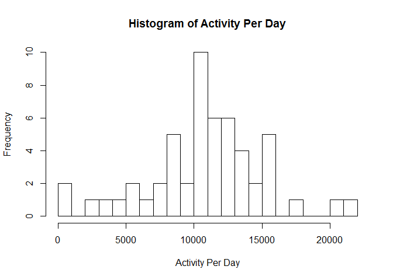
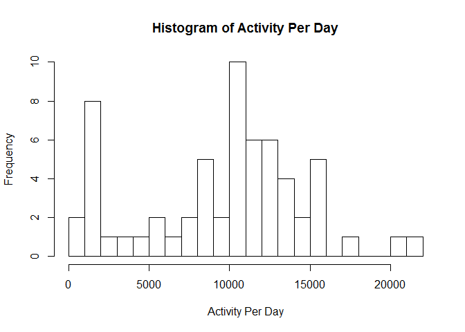
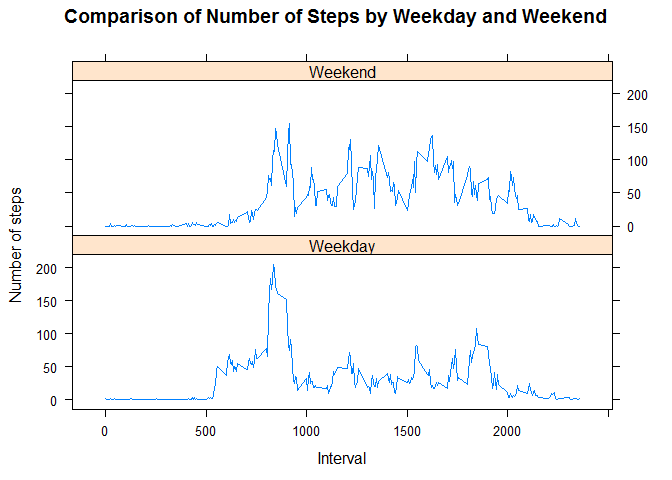

# Reproducible Research: Peer Assessment 1

```r
library(dplyr)
```

```
## 
## Attaching package: 'dplyr'
```

```
## The following objects are masked from 'package:stats':
## 
##     filter, lag
```

```
## The following objects are masked from 'package:base':
## 
##     intersect, setdiff, setequal, union
```

```r
library(lattice)
```


## Loading and preprocessing the data

The data required for this analysis can be downloaded from the following link
* Dataset: [Activity monitoring data](https://d396qusza40orc.cloudfront.net/repdata%2Fdata%2Factivity.zip) [52K]


```r
activity<-read.csv("./activity/activity.csv")
activity<-tbl_df(activity)

activityperday <- activity %>% group_by(date) %>% summarise(steps=sum(steps)) 

activityperinterval <- activity %>% group_by(interval) %>% summarise(averagesteps= mean(steps,na.rm=TRUE),mediansteps = median(steps,na.rm=TRUE)) 
```


## What is mean total number of steps taken per day?

The following histogram shows total steps per day

```r
hist(activityperday$steps,20,main="Histogram of Activity Per Day",xlab = "Activity Per Day")
```

<!-- -->

The following table includes the median and median steps

```r
summary(activityperday$steps)
```

```
##    Min. 1st Qu.  Median    Mean 3rd Qu.    Max.    NA's 
##      41    8841   10760   10770   13290   21190       8
```


## What is the average daily activity pattern?

The following line chart shows average steps per day

```r
plot(activityperinterval$interval,activityperinterval$averagesteps,type="l",main="Average Steps per Interval",xlab="Interval",ylab="Average Steps")
```

<!-- -->

Interval 835 on average contains the most steps per day as shown by the following output

```r
activityperinterval[which.max(activityperinterval$averagesteps),]
```

```
## # A tibble: 1 × 3
##   interval averagesteps mediansteps
##      <int>        <dbl>       <int>
## 1      835     206.1698          19
```

## Imputing missing values

The following compares total rows in activity data set with number of rows that are complete (no NA's)

```r
nrow(activity)
```

```
## [1] 17568
```

```r
sum(complete.cases(activity))
```

```
## [1] 15264
```

To allow for the missing values we will apply the median value for the interval to any missing values

```r
cleanactivity <- activity %>% left_join(activityperinterval) %>% mutate(cleansteps = ifelse(is.na(steps),mediansteps,steps)) %>% select(steps,date,interval,cleansteps)
```

```
## Joining, by = "interval"
```

```r
cleanactivityperday <- cleanactivity %>% group_by(date) %>% summarise(cleansteps=sum(cleansteps)) 
```

The following histogram shows total steps per day after cleaning away missing values

```r
hist(cleanactivityperday$cleansteps,20,main="Histogram of Activity Per Day",xlab = "Activity Per Day")
```

<!-- -->

The following table includes the median and median steps

```r
summary(cleanactivityperday$cleansteps)
```

```
##    Min. 1st Qu.  Median    Mean 3rd Qu.    Max. 
##      41    6778   10400    9504   12810   21190
```

By removing the missing values we've reduced the median and mean steps.

## Are there differences in activity patterns between weekdays and weekends?

To compare activity between weekdays and weekends we'll add in a new factor variable

```r
cleanactivity <- cleanactivity %>% mutate(weekday = weekdays(as.Date(date)),weekdayclass = ifelse(weekdays(as.Date(date)) %in% c("Saturday","Sunday"),"Weekend","Weekday"))

cleanactivityperinterval <- cleanactivity %>% group_by(interval,weekdayclass) %>% summarise(averagesteps= mean(cleansteps,na.rm=TRUE),mediansteps = median(cleansteps,na.rm=TRUE)) 
```

Plot the differences between Weekends and Weekdays

```r
xyplot(cleanactivityperinterval$averagesteps~cleanactivityperinterval$interval|cleanactivityperinterval$weekdayclass,type="l",layout=c(1,2),ylab="Number of steps",xlab="Interval",main="Comparison of Number of Steps by Weekday and Weekend")
```

<!-- -->
